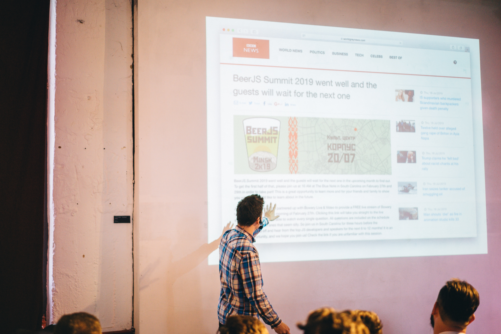

# С дороги, мешок

*Расшифровка доклада [«С дороги, мешок»](https://twitter.com/BeerJSSummit/status/1145003684427980800) на [BeerJS Summit 2019](https://beerjssummit.com/). Многое из-за тайминга не прозвучало. Слайды [online](https://www.icloud.com/keynote/0CQ9RP5sYAX672pk5-T4f2lig#from-the-road-meshok).*

Привет!

Меня зовут Роман Пономарев. Сейчас коротко поговорим о влиянии искусственного интеллекта на нашу жизнь и куда нам, скажем там, органическим существам, мешкам, деваться.

Я из Питера, работаю сеньером фронтенда в компании [Arrival](https://arrival.com/), создаем электромобили. Также я являюсь соучастником подкаста [Фронтенд юность](https://youknow.st/) и с недавнего времени создателем проекта [Maria Machine](https://medium.com/maria-machine) о машинном обучении, где происходят переводы и, я надеюсь, будет и другое. Сразу скажу, я не специалист по искусственному интеллекту или машинному обучению, скорее наоборот, но я хочу начать разбираться.

Не стоит долго останавливаться, все это итак чувствуем, но темы искусственного интеллекта и машинного обучения, часто они смешиваются в одно, становятся все популярней. Обратите внимание, что в топе Китай, в этих направлениях он особенно крут и поговаривают, что гонка всех остальных уже проиграна. Кто-то ищет в них решение проблем и задач, например, для бизнеса, кому-то просто интересен флер футуризма и технопорно вокруг этого, кто-то из страха перед большим братом или крахом карьеры.

Вот список областей, куда искусственный интеллект способен внести огромный вклад. Большой список, и транспорт, и ресурсы, и страхование, и медиа. Тут же сразу краткий вывод по поводу страхов: повсеместное внедрение искусственного интеллекта приведет к росту экономики и продуктивности, но людям придется подстроиться, самый простой способ из которых усилить свои скиллы как специалистов.

Но так ли страшен волк? Давайте посмотрим, какая существует информация.

Безусловно автомобили без водителей, Китай уже тестирует на отдельных автобанах так, как не снилось никому, в первую очередь история придет в грузовую перевозку, тут очевидно все намного проще, чем сегмент пассажироперевозок. Юристы попадут под откос и это тоже сильно ожидаемо, так как в идеальном мире законы не должны трактоваться двояко - чем тут не хороша бездушная машина?

Из забавного - орнитологи. Птиц сложно отличать между собой, но и это уже искусственный интеллект освоил до уровня дворовой кормушки. Нянь будут собеседовать анализом их социальных сетей (нужно будет дать доступ), что сразу исключает в будущем плохих нянь, но и право на приватность. Конечно же, священники, почему о них сразу не подумали. Но, говорят, что в рамках буддизма это не так чтобы сильно странно.

Никто не будет спорить, что круто заменить саперов. Из очевидного еще переводчики, тренеры и ассистенты (колл-центр от google для бронирования ресторанов наделал много шума в прошлом году). Финансовая сфера, маркетинг, погода - там, где все держится на данных. Также сфера копирайта и контент менеджмента. Игры: шашки, шахматы, го, покер уже побеждены.

В высоких технологиях эстония крута, там вводят помощь врачам и это хороший правильный пример, когда искусственный интеллект не заменяет, а работает вместе, помогает. В целом в здравоохранении очень много данных, а следовательно и работы для машинного обучения, что опять же очевидно улучшить жизнь человека. Как и здоровое питание, например.

В творческих историях - музыка в целом и недавно хайпанул метал. Есть поклонники металла? Какие группы? Так вот, скоро их заменят. Как и ваших любимых художников и их выставки. Недавно в Питере в Эрмитаже была выставка работ искусственного интеллекта в области искусства, а раньше на Кристис была продана первая картина, созданная машиной. Но и нам искусственный интеллект поможет лучше рисовать, что нереально круто для таких людей, как я. В целом, в культуре тоже огромный пласт где развернуться, например, недавно была продана скульптура, которую разработал искусственный интеллект, а из железа, на котором он был замещен, скульптуру потом и сделали. На конкурсах жюрить будет искусственный интеллект, писать поэмы будет тоже он.

Искусственный интеллект в целом может заменить ученых и открывать вселенную. Из тонких материй еще парфюмерия, вязание (*он хочет заменить бабушек!*), фешн-индустрия в целом, анимация. Под угрозой даже романтика (*как же легко на основе данных предсказать, полюбите ли вы!*), а машины всегда романтизировались как места для встреч, а с драйверлесс история получает новый оборот.

В области социального взаимодействия искусственный интеллект, безусловно, тоже не отстает: пранки, блогинг, фуд блогинг, помощь вам в снятии классной картинки (тоже пример хорошей коллаборации). Искусственный интеллект выпускает целые номера журналов, заменяя редакцию, ну, и, конечно, пишет фейковые новости.

Осталось создавать платы для самого себя и это тоже он умеет. Что еще осталось? Осталась наша молодость, но и ее пытаются преждевременно забрать. Все выложили фото себя старых в инстаграм? Что еще осталось? Конечно, остался фронтенд. Очень творческая история, но если уже и картины можно рисовать, то почему бы и не верстать? Можно, и есть куча инструментов типа sketch2code. Но что, если дать машине задачу написать какую-то программу? Такие разработки тоже ведутся и есть определенные победы. Называется NEURAL SKETCH LEARNING и есть имплементация - BAYOU - говорите, какую хотите программу и вуаля она готова. Опять же, что нужно определяет человек, машина лишь исполнитель, а человеку остается чистое творчество - строить продукт.

Бывает искусственный интеллект входить в наши инструменты незаметно. Например, появился grammarly для кодеров: такой линтер на максималках. Главная фишка всех инструментов, что код человека анализируется не в абстракции неких правил, а в качестве примеров используется бесконечная база подобных имплементаций.

Что искусственный интеллект изменит мир понятно и только что мы это обсудили. Но хорошо ли это или плохо? Может выглядеть полнейшим геноцидом, но вообще, ничего плохого. Искусственный интеллект забирает на себя сложную, монотонную, рутинную работу и работу среднего ума специалистов. Людям же остается творческая и высококвалифицированная работа, долголетие благодаря искусственному интеллекту и его медицине, безопасность благодаря драйверлес и прозрачному правовому полю, новые рабочие места, так как появляются и развиваются новые области знаний, всплеск развития культуры за счет появления еще одного в кавычках интеллекта, новые запахи, вкусы, цвета. Умная реклама, которую возможно я бы не выпиливал в таком количестве с этого огромного количества слайдов. И так, далее, далее, далее, аналитики море.

Короче, искусственный интеллект наступает, с чем вас и поздравляю. Конечно, все это правда ровно на столько, на сколько вы готовы в это поверить. Так как я мог вам показывать, например, эту новость, эту статью. Почему нет? Где та грань, которая отделит искусственный мир от реального, когда искусственный интеллект получит повсеместное внедрение? И нужна ли эта грань? Ответ еще предстоит найти.

Если вы готовы искать и ускорять будущее, инструментов море, курсов еще больше, что даже приводить не буду. Даже пенсионеры в финляндии включились, ведь очень важен опыт в области, куда прикладывается искусственный интеллект. Из инструментов, конечно же, TensorFlow во всех его проявлениях. Есть там и JavaScript. Конечно, придется копнуть в Python, очень много всего именно на нем. Но все мы тут пишем на JavaScript, так что можно переломить ситуацию (вспомним как JavaScript приходил на сервер и поймем, что все возможно). Есть еще вот такая интересная наука - математика (*понимаю, что не все среди нас фронтендеров много о ней слышали, включая меня, но в нее тоже придется копнуть*). А вообще со временем все упрощается, становится доступным, куча моделей доступно по API и существует куча готовых блоков, из которых можно складывать свой конструктор: все зависит от ваших целей, что-то можно написать и на коленке абсолютно без всего.

Спасибо!

---

*Подписывайтесь, лайкайте, хлопайте, репостите! **Это действительно важно, спасибо 🙌🏻** Канал: [maria_machine](https://t.me/maria_machine). Чат: [maria_machine_chat](https://t.me/maria_machine_chat). Twitter: [mariamachine_ml](https://twitter.com/mariamachine_ml). VK: [maria_machine](https://vk.com/maria_machine). FB: [maria.machine.ml](https://www.facebook.com/maria.machine.ml). Github: [maria-machine](https://github.com/maria-machine).*